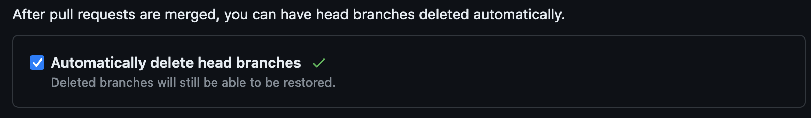
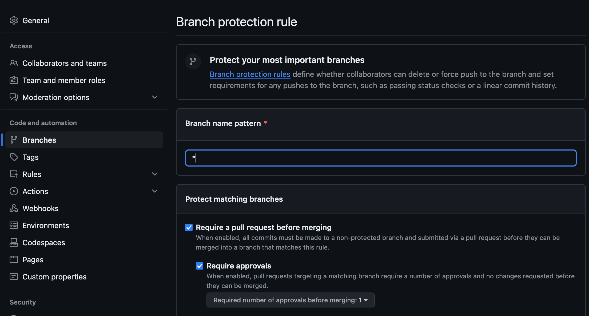

# GitHub

## Repository Documentation
Each repository should be documented with a README.md. The README.md should outline the purpose and scope of the project. The README.md should set forth repository-specific coding conventions (i.e. what are the languages and packages being used). These coding conventions should not conflict with organizational conventions for the languages used in the repository.

## Directories

### Directory Naming

- Directory names should be both machine and human readable. 
- Consider including the client name or abbreviation in the top level project directory name, when possible.
- Use _ the folder name into components. Avoid special characters, as they can cause errors or compatibility issues.
- Name folders to reflect their content. Avoid including team names, as they may change.
- Be specific to differentiate between similar projects/categories.
- Use leading zeros for sequential numbering, when needed (e.g., “01”).
- Prefer lowercase for directory names.

### Directory Structure

A good folder structure should be hierarchical, modular, and scalable, and avoid nesting too many subfolders or creating duplicates. Adopt the following standards when setting up the initial directory structure.

- Main Directory: Start with a main directory for the project.
- Common Subdirectories: Within a project directory, general folders include:
    - Code: Contains all code to generate desired results and outputs.
        - If the Code folder contains many scripts and/or these scripts are written in multiple languages, consider including subdirectories by language or technology (e.g. Python/, SQL/).
    - Input: Contains datasets relevant to the project.
    - Intermediate: Contains intermediate outputs for analyses etc.
    - Output: Contains visuals, graphs, tables, datasets or other outputs derived from code.
    - Archive: Contains older versions of code no longer needed or in use.
- Functionality-based Subdirectories: Further subdivide directories based on functionality or modules if the project is extensive (e.g., Utils/, Models/, Views/).
- Test Directories: Include directories for testing code (e.g., Tests/, Spec/, or Test/).

### File Organization

- Separate Files by Functionality: Keep related files together within directories to improve readability and maintainability.
- Avoid Large Directories: If a directory becomes too large, consider further subdivision or refactoring to improve navigation.

### Version Control Files
- Include version control files like .gitignore to manage versioning and ignore unnecessary files.
- In general, data should be ignored. Data containing PII or other privileged information must be ignored (and may be better suited to storage outside of a directory under git version control).
- Take care when tracking notebook files, particularly .ipynb files.
    - These files store rendered output which will be visible on GitHub.
    - It is best to add .ipynb files to your .gitignore.
- See [.gitignore example](./resources/gitignore_example.txt) for a sample .gitignore file.

### Dependency Management

- Separate Dependency Directories: Keep dependencies separate from the main codebase, especially for larger projects.
- Use Package Managers: Utilize package managers (e.g., pip for Python, npm for JavaScript) to manage dependencies efficiently.
- Document Dependencies: Document external dependencies and their versions in a requirements.txt, package.json, or equivalent file.

### Build and Configuration Files

- Configuration Directories: Keep configuration files separate from source code (e.g., Config/, Settings/).
- Standardize Configuration Names: Follow a consistent naming convention for configuration files to improve readability and maintainability.

### Continuous Integration and Deployment (CI/CD)

- CI/CD Configuration: Include files for CI/CD workflows (e.g., .gitlab-ci.yml, .github/workflows/) in the root directory or a dedicated CI/CD directory.

### Other Considerations

- Renaming directory names can have adverse consequences, e.g., breaking downstream links.
- Keep in mind that file paths cannot extend beyond certain limits:
- SharePoint/OneDrive path limit is 400 characters.
- Windows path limit is 260 characters.

## Repository and Branch Naming Conventions

It is important to standardize our repository and branch naming conventions across projects. Standard naming conventions makes finding one's own work and understanding the work of others easier.

### Repositories

Repository names should be descriptive, but concise. They should avoid including any names or information that is subject to change. Renaming a repository can lead to broken links within the repository itself, or within other repositories that reference it. Separate repository names with dashes, and use only lowercase letters in the name where possible. Examples of good repository names include:[1](https://github.com/bcgov/BC-Policy-Framework-For-GitHub/blob/master/BC-Gov-Org-HowTo/Naming-Repos.md) [2](https://climbtheladder.com/10-github-repository-naming-best-practices/)
- acf-datasurge-standards
- arch-brainstorm-session

### Branches
As with repository names, branch names should be descriptive and concise. Use slashes to separate parts of branch names, and define grouping words to differentiate and sort branches (i.e. fix/, feat/, wip/, bug/, etc.). If Jira and GitHub are integrated, include the Jira issue key in your branch name.[3](https://support.atlassian.com/jira-software-cloud/docs/reference-issues-in-your-development-work/) Do not include leading numbers in branch names. Examples of good branch names include[4](https://stackoverflow.com/questions/273695/what-are-some-examples-of-commonly-used-practices-for-naming-git-branches):
- feat/python-watcher-service
- fix/pir-ingestion
- JRA-123-\<branch-name>

## Branch Management
Work should rarely, if ever, be done on a repository's main branch. For each new task or issue, a new branch should be created. When creating a new branch, the default behavior should be to branch from main. This convention can be foregone if there is good reason, i.e.: 1) The new branch builds on work in an existing branch or 2) the work done in this new branch is experimental and will ultimately be merged into a branch that was branched from main (this is not an exhaustive list of examples). After a branch is fully merged into main, delete it from GitHub. Whether local versions of a branch are kept is up to the programmer, but they should be aware that these local branches are no longer tracking a remote branch.[5](https://git-scm.com/book/en/v2/Git-Branching-Branches-in-a-Nutshell)

## Pull Requests
The ideal way to integrate work into the main branch is via pull requests (PRs). Each PR should include a clear title and a description of the work included. If the pull request resolves or is linked to one or more issues, include the issue number(s) in the body of the pull request or in the title. Also consider including [closing keywords](https://docs.github.com/en/get-started/writing-on-github/working-with-advanced-formatting/using-keywords-in-issues-and-pull-requests) where applicable.

A pull request should be reviewed by at least one team member before it is merged into the main branch. Repositories should have rules requiring at least one approving review before merging a pull request.

## Commits
Commit frequently. There is little or no downside to making commits and regularly committing can help retrieve work more easily. After completing a feature or module consider making a commit.

Strong commit messages will also make retrieving work and understanding a repository easier. A commit message should consist of two parts: 1) A subject line (limited to 72 characters on GitHub) and 2) a descriptive body outlining what was done in the commit.[6](https://www.theodinproject.com/lessons/foundations-commit-messages) [7](https://cbea.ms/git-commit/) If Jira and GitHub are integrated and the commit is related to a Jira issue, include the Jira issue key in the body of the commit message.[8](https://support.atlassian.com/jira-software-cloud/docs/reference-issues-in-your-development-work/)